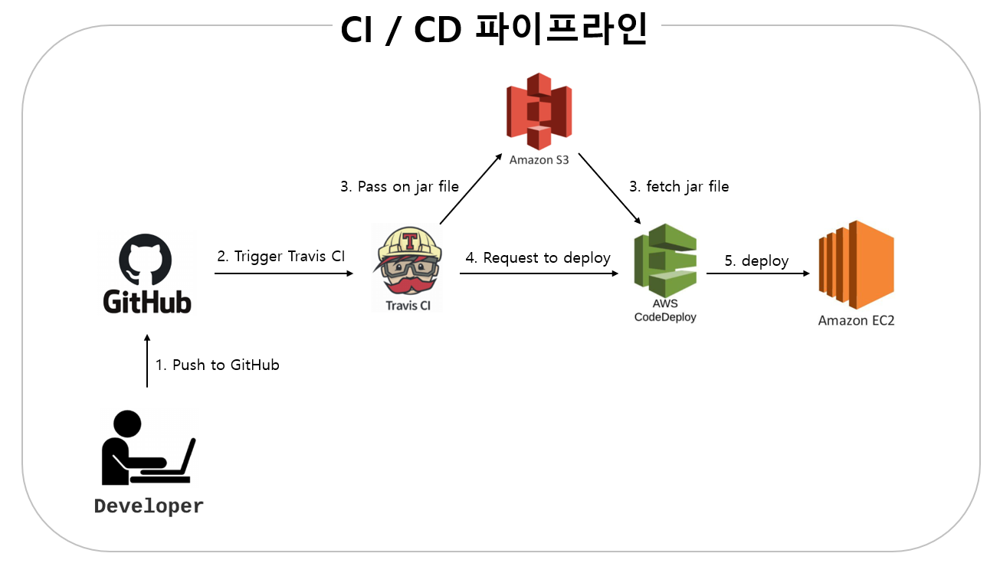

# 스플럭 웹페이지

Table of contents
=================
* [구현 내용](#구현-내용)  
* [구현해야 할 내용](#구현해야-할-내용)  
* [CI/CD 파이프라인](#cicd-파이프라인)  
    *  [개요](#개요)
    * [구성도](#구성도)
    * [특이사항](#특이사항)
    * [자동 배포 순서](#공정-프로세스)
* [사용법](#사용법)
* [QA](#QA)
* [기여자](#기여자)
* [참고](#참조)

---
## 구현 내용

  - 공지사항, 자유게시판, 활동게시판 구현(CRUD)
  - CKeditor4로 글 쓰기 페이지 구현 및 이미지 업로드 구현
  - 댓글 생성 및 조회 구현(update, delete는 프론트 미구현)
  - 회계 내역 생성 및 조회 구현(update, delete는 프톤트 및 백엔드 미구현)
  - 게시글 조회수 기능 추가
  - SpringSecurity 적용
  - 로그인 및 회원가입 구현
  - 활동게시판 썸네일 구현
  
## 구현해야 할 내용

  - 댓글 CRUD(프론트)
  - 로그인 프론트
  - 체크된 공지사항 상위 노출 기능
  - 댓글 수 표시
  - 좋아요 싫어요 표시
  - 그림이 있으면 그림있는 표시
  - 게시글 검색기능
  - 관리자 페이지(유저 권한 설정)

## CI/CD 파이프라인
### 개요
- 개발자가 본업인 **서비스 개발 업무**에 집중할 수 있는 여건 구축
  - 자동으로 빌드하여 EC2에 배포하는 **지속적인 통합/배포 파이프라인 공정** 구성
  
### 구성도
  

### 특이사항
- k8s에 웹 애플리케이션을 공식적으로 배포한 다음, 현재 develop 브랜치의 역할을 master 브랜치로 이양
1. Current
  - develop 브랜치로 push할 경우 : S3로 배포 파일 전달 및 EC2에 배포 진행
  - master, feature 브랜치로 push할 경우 : Travis 서버에서 자동 빌드 (빌드 실패 시, 지정된 메일로 알림 발송)

1. 정식 배포
  - master 브랜치로 push할 경우 : S3로 배포 파일 전달 및 운영 서버에 배포 진행 (지정된 메일로 알림 발송)
  - develop 브랜치로 push할 경우 : S3로 배포 파일 전달 및 개발 서버에 배포 진행 (빌드 실패 시, 지정된 메일로 알림 발송)
  - feature 브랜치로 push할 경우 : Travis 서버에서 자동 빌드 (빌드 실패 시, 지정된 메일로 알림 발송)
  
- AWS CodeDeploy는 Jar 파일을 인식하지 못하므로, 압축 파일로 전달

### 공정 프로세스
**[2번](#2.-구성도)에 명시된 절차에 따라 세부 내용 설명**
#### Push to Github
- 개발자가 코드 변경 사항을 지정된 Github 브랜치에 push

#### 1. Trigger Travis CI
- Travis 서버는 이를 감지하고 gradle 자동 빌드
- 빌드 실패 시, 지정된 메일로 알림 발송
- .travis.yml 파일에 따라 작업 진행
- 대상 브랜치 : master, develop, feature

#### 2. Pass on jar file
- 빌드가 완료된 파일을 zip 파일로 압축하여 AWS S3에 전달
- 대상 브랜치 : develop

#### 3. fetch jar file
- AWS CodeDeploy에 zip 파일 전달

#### 4. Request to deploy
- Travis 서버는 AWS S3를 통해 전달한 zip 파일을 실제 서버에 배포 요청

#### 5. deploy
- appspec.yml 파일에 따라 배포 작업 진행

## 사용법

- config 폴더의 MvcConfiguration.java 이미지 Resource 경로 수정
```git
addResourceLocations("file:///{이미지 Resource 폴더 경로}")

ex) addResourceLocations("file:////Users/ggomak/Desktop/SplugServerImg/")
```

- service 폴더의 ImageUploadService.java 이미지 업로드 경로 수정
```git
private String fileDir = "{이미지 업로드 경로}";

ex) private String fileDir = "/Users/ggomak/Desktop/SplugServerImg/post/";
```
  
## QA
  
  - addAccount.html input class 정수형으로 변경

## 기여자
- [정지수](https://github.com/GGoMak)
- [박진우](https://github.com/JJINUUU)
- [임규형](https://github.com/GyuHyoung)
- [김도영](https://github.com/develop-kimdoyoung)

## 참조

  - CKEditor4
  - ImageUploadService : https://mine-it-record.tistory.com/
  - Template : https://unsplash.com/
